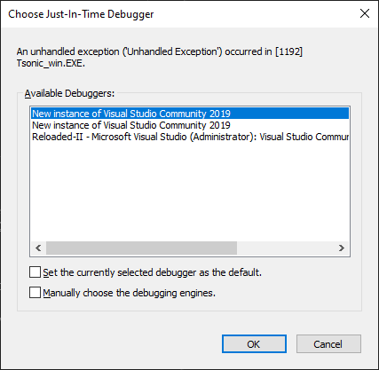

	<h1>Reloaded II: Building Mods</h1>
	
	   
	<strong>Easy as 1,2,3</strong>
	 
    The other steps are boring...
     
    So to bring balance to the universe, I just cut them out.

# Table of Contents
- [Prerequisites](#prerequisites)
- [Project from Template](#project-from-template)
    - [1. Import the Visual Studio Template](#1-import-the-visual-studio-template)
    - [2. Update the Mod Configuration and Image](#2-update-the-mod-configuration-and-image)
    - [3. Building And Debugging](#3-building-and-debugging)
    - [4. Publishing](#4-publishing)
- [Creating Project From Scratch](#creating-project-from-scratch)

# Prerequisites

- Visual Studio 2017+
- .NET Core 3.0 SDK (or newer)

# Project from Template

### 1. Import the Visual Studio Template
The template, named `Reloaded II Mod Template.zip` can be found in the root of this repository.

To add it to Visual Studio, copy the zip to `C:\Users\[User Name]\Documents\[Visual Studio Version]\Templates\Project Templates`. 

You may now create a new project.

*(If the project(s) do not show up, this is a Visual Studio bug. Close Visual Studio, open the Visual Studio developer command prompt and run `devenv /updateConfiguration`.)*

### 2. Update the Mod Configuration and Image

Once imported, update the `ModConfig.json` file with the relevant details of your project. 

Then proceed to replace the mod preview image `Preview.png`.

### 3. Building And Debugging

Make a new folder in Reloaded II's mods folder and change the project's output directory to it. You can build the mod by simply building the solution in Visual Studio.  

To debug your mods, the easiest option is to simply add `Debugger.Launch();` to the `Start()` entry point. When executed, you will receive a prompt to start or use running version of Visual Studio.

### 4. Publishing

In order to publish your mod, open the mod folder in file explorer and run the `Publish.ps1` script (*Right Click -> Run with Powershell*). 

This will automatically build and archive your project. You will find a zip in the `Publish` directory, ready for sharing with the internet. 

Publishing performs an additional optimization to your mod called `ReadyToRun`. [More about it here](./ReadyToRun.md).

----

**P.S.** If you are also publishing the source code (e.g. to a public git repository), don't forget to reset the project output path before you commit.

# Creating Project From Scratch 

If you would rather not use a template, [here](./ProjectFromScratch.md) is how to recreate the template and create a mod project from scratch.

There is no real benefit to creating a project from scratch, this is provided merely for the curious.
