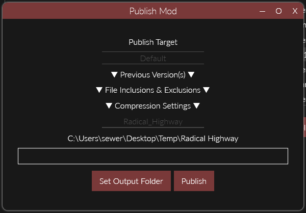
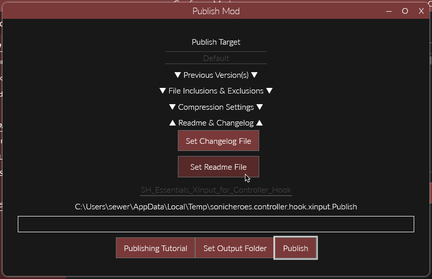
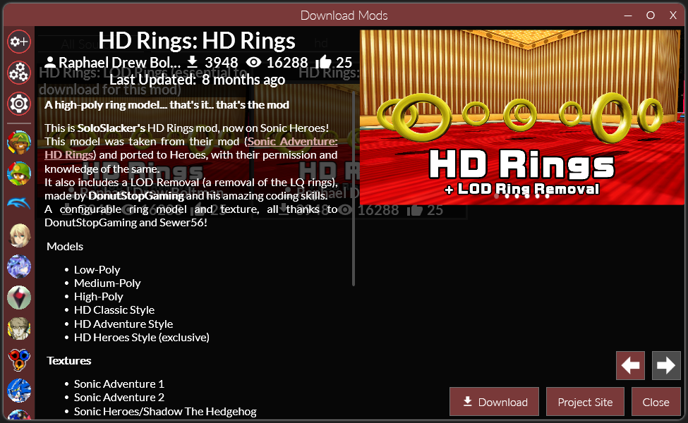
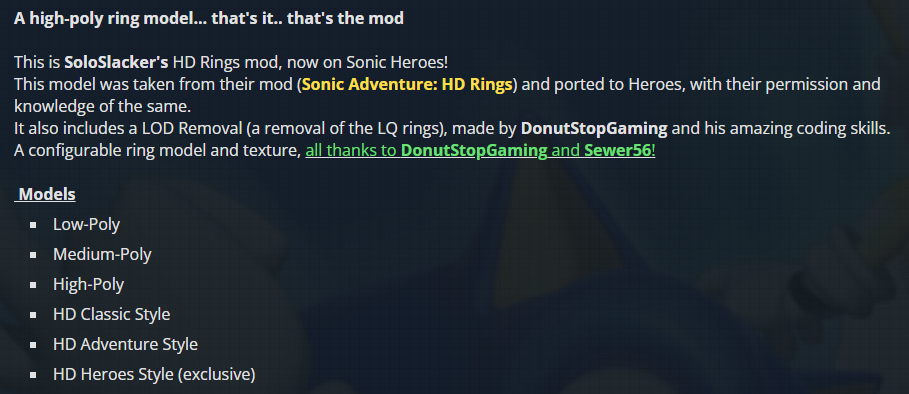

# Uploading Mods

Before uploading a mod, you should first create a `Release`.  
A `Release` consists of 2 files:  
- Compressed version of your mod.  
- JSON text file containing update information.  

## Creating Releases

### From the Launcher

In order to create a release for a mod, right click the mod and hit `Publish` in an individual application's main page.  

  

  

Select the `Publish Target` from the dropdown.  
(Use `Default` if your website/location is not present in the list.)

Click Publish, and upload the generated `.7z` files and `.json` file to the world.  

### From the Commandline

!!! note

    If you are making a code mod, it is recommended to use the Publish script from the [Mod Template](./ModTemplate.md).  

    The following instructions are provided for people wishing to make their own build scripts.  

Reloaded comes with a set of tools that can be used to create releases outside of the launcher.  

- `Reloaded.Publisher.exe` [Recommended]: Publishes a release for a mod. Identical features to GUI's `Publish Mod` menu.  
- `NuGetConverter.exe` [Legacy]: Automatically creates a NuGet package given a mod folder or a mod zip.  

You can get them from either of the 2 sources:  

- Via [GitHub Releases](https://github.com/Reloaded-Project/Reloaded-II/releases) (`Tools.zip`).  
- Via [Chocolatey](https://chocolatey.org/packages/reloaded-ii-tools).  

## Delta Updates

Reloaded allows for the creation and usage of delta updates.  

A delta update is an update that only requires the user to download the code and data that has changed instead of the whole mod.  

- If version `1.0.1` adds `8MB` worth of files, the user will only need to download `8MB` to update from `1.0.0` (instead of e.g. `500MB`) for a big mod.  
- If `1MB` out of a `100MB` file is changed, the user will only need to download `1MB`, not `100MB`.  

To create a delta update, do the following:  
- Download the previous version of your mod (including `.json` file!).  
- Check `Automatic Delta` in `Delta Update` tab.  
- `Set Output Folder` to the location of the previous update.  

!!! note

    If you have an unpacked version of your previous mod, i.e. as a raw folder; you can add that in the `Delta Update` tab instead.  

## Adding Changelog, Readme & Other Details

!!! info "About Markdown"

    Reloaded uses Markdown [(tutorial)](https://commonmark.org/help/tutorial/index.html) for its text documents.  
    If you ever use *italics* and **bolds** in your Discord/Reddit posts, you're probably familiar with a small bit of Markdown.  
    Markdown files use the file extension `.md` and can be saved/opened with any text editor.  

!!! tip

    Markdown editors such as [Dilinger](https://dillinger.io) and [Typora](https://typora.io) allow you to preview your formatted text in real time.  

You can add changelogs and readme files during the publish step by clicking the `Set Readme File` and `Set Changelog File` buttons respectively.  

  

In the selection dialog, select the file (`.md`) containing the text to be included; e.g. `Readme.md` for the Readme and `Changelog.md` for the Changelog.  

### Automatic Inference

!!! info

    Reloaded tries to make the experience consistent, even with old mods that don't have a `.json` file with extra info.  
    When possible, Reloaded will try to guess unknown details such as readme, changelog and mod title automatically if they are not available.  
    
Here is an example:  



The description was automatically copied from GameBanana's description on their site:  



The mod name is a combination of the page name on GameBanana `HD Rings` and the description of the file `HD Rings`, hence `HD Rings: HD Rings`:  


## Uploading to NuGet

When creating a release, please select the `NuGet` publish target. This should output a `.nupkg` file, which you will upload.  

The easiest way to upload a package is to install the [.NET SDK](https://dotnet.microsoft.com/download/dotnet/thank-you/sdk-5.0.101-windows-x64-installer) and use the `dotnet` commandline utility. 

Example:  
```
# Upload package.nupkg to the official Reloaded server.
dotnet nuget push -s http://packages.sewer56.moe:5000/v3/index.json -k API-KEY package.nupkg
```

[Upload instructions for the official Reloaded package server](http://packages.sewer56.moe:5000/upload).  