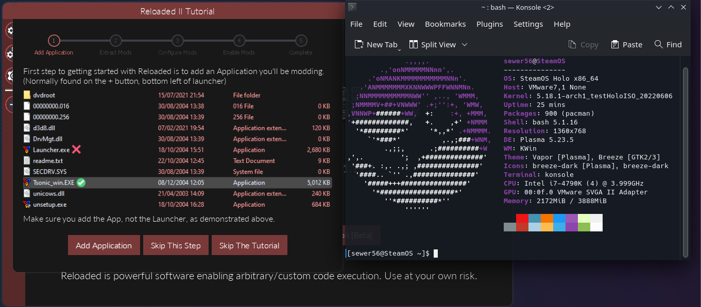
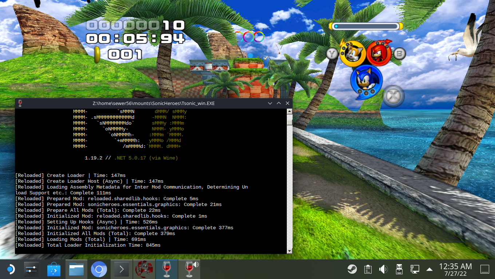

# Linux Setup Guide

!!! help "Help Needed"

    This documentation page could be improved, it only covers the barebones information.  
    Community contributions would be very welcome. 

!!! warning "Work in Progress"

    This page is a work in progress.

## Wine

Open a `Terminal` window (Konsole, GNOME Terminal, Kitty etc.) and install `wine` & `winetricks`:  

| Distro                              | Command                               |
|-------------------------------------|---------------------------------------|
| Apt Based (Ubuntu, Debian etc.)     | `sudo apt install wine winetricks`    |
| Arch Based (Arch, SteamOS, Manjaro) | `sudo pacman -S wine winetricks`      |
| Fedora                              | `sudo dnf -y install wine winetricks` |

After installing wine, run `winetricks` from your terminal, we will install `.NET Framework`, which is used by the Reloaded installer.  

Run the following command:

```bash
winetricks dotnet48
```

You can then download the Reloaded Installer (`Setup.exe`) from the downloads page, and run it via Wine (doubleclick).  

!!! info

    The installer automatically installs Reloaded and dependencies for you.  
    If the window does not render; don't worry the installer will still automatically complete.  
    This process usually downloads ~120MB of data and takes 30-60 seconds for most people.  

Once install completes, Reloaded will be on your desktop. If you cannot see it there, check Wine's Desktop folder (usually located in `<your_home_dir>/.wine/drive_c/users/<username>/Desktop/`).  



[Reloaded running on Modified SteamOS 3.0 (HoloISO), to simulate a Steam Deck]



### Finding (Steam) Games

!!! hint

    Wine by default hides files and folders that start with a dot; which might make it difficult to navigate to Steam games. To fix this, run `winecfg` (Wine Configuration) and check `Show dot files` in the `drives` tab.  

!!! warning

    Reloaded does not yet currently know how to resolve symlinks or native paths.  
    Don't paste the file path from your file explorer, instead use the wine's file picker dialog (`Update` button) to set the game path.  

The easiest way to find your Steam games is simply right clicking the game, right click and clicking `Manage -> Browse local files`.  

Then when adding the game in Reloaded, go to the folder opened by Steam inside the file picker.  
The path is most likely to be of the format `/home/<username>/.local/share/Steam/steamapps/common/<game>/`.  

Your path should not start with `/home/<username>/.steam/steam/`, that is a symlink.  

### Using ASI Loader

!!! info

    You can launch Reloaded via the ASI Loader in the case that launching from Reloaded Launcher does not work.  
    This will make it so Reloaded gets loaded naturally as part of the game's boot process (i.e. it will be automatically loaded when you start the game from outside the launcher).

To do this, go to `Edit Application -> Advanced Tools & Options -> Deploy ASI Loader`.  


Note down the name of the non-Reloaded DLL that has been placed inside the installation directory. In this case the name is `VERSION.dll`.  

Then you will need to make sure that Wine will load this DLL; there is more than 1 way to achieve this:  

- `WINEDLLOVERRIDES` lets you temporarily specify DLL overrides for a specific wine process. You can use it in the terminal as such: `WINEDLLOVERRIDES="version=n,b" wine BTD5-Win.exe`.  

If you are using Steam to launch your games you can, Right Click Game in Library, `Properties` and in `Launch Options` add `WINEDLLOVERRIDES="version=n,b %command%"`.  


- Alternatively, for a more permanent solution, you can run `winecfg` (Wine Configuration), navigate to `Libraries`, select the DLL in the `New override for library` box and click `Add`.  


Now Reloaded should automatically start with your game outside of the launcher.  

### Installing Reloaded Manually

!!! info

    If the installer does not work, or you wish to manually install Reloaded for any other reason, you can follow the instructions below.  

Download and extract `Release.zip` form Reloaded's Latest Release:  
- [Reloaded-II Release](https://github.com/Reloaded-Project/Reloaded-II/releases/latest)

Download and install the following in Wine:  
- Visual C++ 2015+ Runtime [x86](https://aka.ms/vs/17/release/vc_redist.x86.exe) AND [x64](https://aka.ms/vs/17/release/vc_redist.x64.exe).  
- .NET 5 Desktop Runtime [x86](https://dotnet.microsoft.com/en-us/download/dotnet/thank-you/runtime-desktop-5.0.17-windows-x86-installer) AND [x64](https://dotnet.microsoft.com/en-us/download/dotnet/thank-you/runtime-desktop-5.0.17-windows-x64-installer).  

You can now start Reloaded with `Reloaded-II.exe`.  

## Proton

!!! hint

    You should run the game via Proton (Steam) at least once before following this guide.  

!!! info

    The following instructions will allow you to setup Reloaded to run inside your game's Proton configuration.  
    With this setup, [you should still use regular Wine for running the Reloaded launcher](#wine) and instead of launching games via the launcher, you will close the launcher and launch them via Steam.  

!!! info "Coming Soon!"

    Coming Soon (TM). 

## Setting up a Virtual Machine Testing Environment

!!! info

    Following section of the guide is for setting up a SteamOS 3.0 (HoloISO) virtual machine.  
    Distro chosen due to popularity of the Steam Deck, it's currently at the time of writing the closest thing you can get to emulating a Deck user experience.  
    
    This is intended for people who wish to contribute to Reloaded, since testing with a VM can be faster.  

### VMWare Player

Open the `.vmx` configuration file for your virtual machine and add the following line.  

```bash
firmware="efi"
```

- Install HoloISO.  
- Chroot into install (desktop icon).  

```bash
## VMWare Stuff (optional)
pacman -S open-vm-tools nano 
systemctl enable vmtoolsd.service
systemctl enable vmware-vmblock-fuse.service
```

Once booted, to finish installation do the following:  
- In Settings -> Background services -> Disable KScreen 2, to be able to change resolution.  
- If you need copy/paste support, run `vmware-user &` in a terminal.  

### VirtualBox 

!!! warning

    VirtualBox is not recommended. Parts of Reloaded's launcher might not render.  
    This is a VBox specific issue; if you know a workaround, consider contributing to the wiki.  

- Enable EFI 


- Install HoloISO.  
- Chroot into install (desktop icon).  

```bash
## VirtualBox Stuff (optional)
pacman -S virtualbox-guest-utils
systemctl enable vboxservice 

## Force desktop environment
steamos-session-select plasma-persistent
```
