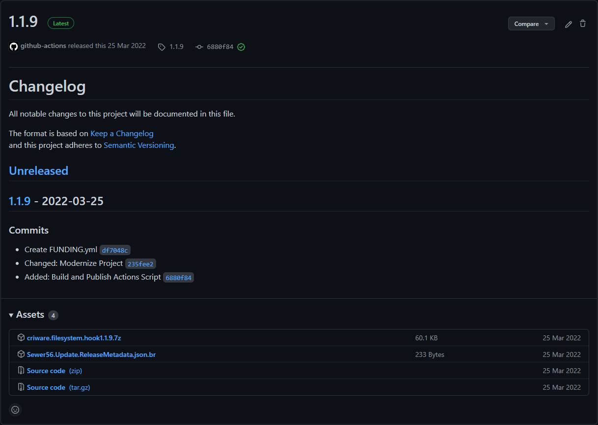

# Mod Template Features

## Publish Script

This template features a built-in publish script that can be used to create releases of your mod.  

To run it, open a Powershell prompt in your mod folder and execute the script as such:  
```powershell
.\Publish.ps1
```

Once the script completes, ready to upload packages will be output to the `Publish/ToUpload`.  

For extended help with the script and examples, consider running:  
```powershell
Get-Help .\Publish.ps1 -Detailed
```

### Delta Updates

Reloaded allows for the creation and usage of delta updates.

A delta update is an update that only requires the user to download the code and data that has changed, not the whole mod all over. It significantly saves on time and bandwidth usage.

```powershell
# Publish using GitHub Releases as the delta source.
./Publish.ps1 -MakeDelta true -UseGitHubDelta true -GitHubUserName Sewer56 -GitHubRepoName Reloaded.SharedLib.Hooks.ReloadedII -GitHubFallbackPattern reloaded.sharedlib.hooks.zip
```

```powershell
# Publish using NuGet as the delta source.
./Publish.ps1 -MakeDelta true -UseNuGetDelta true -NuGetPackageId reloaded.sharedlib.hooks -NuGetFeedUrl http://packages.sewer56.moe:5000/v3/index.json
```

See [Delta Updates](./PublishingMods/#delta-updates) on more information about the topic.

### Publishing as ReadyToRun

!!! note 

    Using ReadyToRun is incompatible with unloadable mods due to a runtime limitation.  
    If you are using ReadyToRun, you should return `false` in `CanUnload()`.

If your mod has a lot of code that is executed at startup, consider using `ReadyToRun` in order to reduce the startup time.  

To use `ReadyToRun` set the `BuildR2R` flag to true when using the build script.  

```powershell
.\Publish.ps1 -BuildR2R true
```

R2R is a new type of officially supported file format, which gives a considerable improvement to startup times by shipping native code alongside standard .NET IL code; at the expense of assembly (DLL) size.  

You can read more about R2R in the following web resources:

- [Conversation about ReadyToRun](https://devblogs.microsoft.com/dotnet/conversation-about-ready-to-run/)  
- [ReadyToRun Compilation](https://docs.microsoft.com/en-us/dotnet/core/deploying/ready-to-run)  

## Automated Builds  

If you are using `GitHub` to host your project, the mod template contains a script for automatically building and uploading your mod for others to download.  

It has the following features:  
- Automatically build mod for `GameBanana`, `GitHub` & `NuGet`.  
- Automatically create changelog (using `git` commits).  
- Automatically upload your mod on tags (releases).  
    - Creates GitHub Release.  
    - Uploads to NuGet (if configured).  
    - If configured correctly, end users will automatically receive update.  

You can find and/or modify the script at `.github/workflows/reloaded.yml`.  

### Accessing Build Results

To access your automated builds, click the `Actions` button, select the latest ran `workflow` and scroll down until you see the `Artifacts` section.  

  
  
  

Please note the `Artifacts` have a limited lifespan, usually GitHub deletes them after around 30 days.  

### Automatic Publishing

In order to publish (upload) your mod, simply push a `tag` to the remote GitHub repository.  When the automated build finishes, the script will create a GitHub release and upload the mod to NuGet (if configured).

Example of an automated release:  

  

#### Publishing to NuGet

Publishing to NuGet requires additional configuration.  
- Set a NuGet Feed URL  
- Set a NuGet API Key

To set the NuGet feed, open `workflows/reloaded.yml` and change the `NUGET_URL` variable. The default is `http://packages.sewer56.moe:5000/v3/index.json` in which points to the official [Reloaded II NuGet repository](http://packages.sewer56.moe:5000).  

To set the API Key, add a [Secret](https://docs.github.com/en/actions/security-guides/encrypted-secrets#creating-encrypted-secrets-for-a-repository) named `RELOADED_NUGET_KEY`.  

### Multiple Mods Per Repository

If you want to use the same repository for multiple mods, it is recommended you create a `PublishAll.ps1` that runs the publish script multiple times with different parameters.  

Here is an example:  

```powershell
# Set Working Directory
Split-Path $MyInvocation.MyCommand.Path | Push-Location
[Environment]::CurrentDirectory = $PWD

./Publish.ps1 -ProjectPath "Reloaded.Universal.Redirector/Reloaded.Universal.Redirector.csproj" `
              -PackageName "Reloaded.Universal.Redirector" `
              -PublishOutputDir "Publish/ToUpload/Redirector" 

./Publish.ps1 -ProjectPath "Reloaded.Universal.Monitor/Reloaded.Universal.Monitor.csproj" `
              -PackageName "Reloaded.Universal.Monitor" `
              -PublishOutputDir "Publish/ToUpload/Monitor" 

./Publish.ps1 -ProjectPath "Reloaded.Universal.RedirectorMonitor/Reloaded.Universal.RedirectorMonitor.csproj" `
              -PackageName "Reloaded.Universal.RedirectorMonitor" `
              -PublishOutputDir "Publish/ToUpload/RedirectorMonitor" 

# Restore Working Directory  
Pop-Location
```

Then modify `workflows/reloaded.yml` to call `PublishAll.ps1` script instead of `Publish.ps1` script.  

Example repositories with this setup:  
- [Reloaded.Universal.Redirector](https://github.com/Reloaded-Project/reloaded.universal.redirector)  
- [Heroes.Controller.Hook](https://github.com/Sewer56/Heroes.Controller.Hook.ReloadedII)  
- [Riders.Controller.Hook](https://github.com/Sewer56/Riders.Controller.Hook)  

