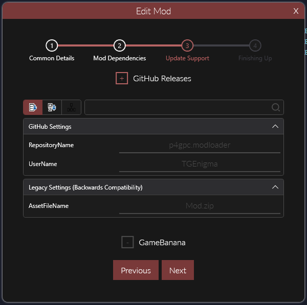

# Publishing Mods

Starting with Reloaded 1.12.0, the update system was revamped, making it more discoverable and easier to use.  
Configurations for updates are now directly stored inside the individual mod's `ModConfig.json` as opposed to files.  

## Enabling Update Support

Support for mod updates can now directly be enabled from the launcher by making use of the `Edit Mod Menu`.  



You can access this menu by right clicking the mod in a game's main page or clicking on the `Manage Mods` tab and selecting `Edit Mod`.  
Consider hovering over the individual configuration fields for help on what each field does.  

Reloaded mod versions use *[Semantic Versioning 2.0](https://semver.org)* for delivering updates.  
Pre-releases are also supported, but must be explicitly enabled by the user (`Edit User Config` -> `Allow Beta Versions`).  

### NuGet 

NuGet is the primary source for downloading mods and searching for missing mod dependencies.
Users can directly download mods via the `Download Mods` menu.

With NuGet, you simply create a NuGet package using Reloaded and upload it to a server, done.  
No support from Delta packages however :/.  

The easiest way to upload a package is to install the [.NET SDK](https://dotnet.microsoft.com/download/dotnet/thank-you/sdk-5.0.101-windows-x64-installer) and use the `dotnet` commandline utility. 

Example:  
```
# Upload package.nupkg to the official Reloaded server.
dotnet nuget push -s http://packages.sewer56.moe:5000/v3/index.json -k API-KEY package.nupkg
```

[Upload instructions for the official Reloaded package server](http://packages.sewer56.moe:5000/upload).

### GitHub Releases

When creating a GitHub releases release, you should only include the current version and (optionally) a delta patch from the previous update.  
This is because GitHub Releases uses the release tag for indicating versions of your mod releases:  


If the GitHub tag version is higher than the local one, there is an update.  

It should also be noted that GitHub has some very strict limits (60 requests per IP per hour!!) for unauthenticated users.  
This shouldn't be much of a problem however, as Reloaded caches all requests made to GitHub and GitHub does not count cached requests against the rate limit.  

### GameBanana

First, upload your mod as a private submission to GameBanana. 
.

Then copy the item ID from the URL of your mod page: 


Insert the number from the URL into the `ItemID` field in the mod configuration, and you are done.

## Creating Releases: GUI

In order to create a release for a mod, right click the mod and hit `Publish` in an individual application's main page.
  

  

After hitting `Publish`, simply upload the generated `.7z` files and `.json` file to your preferred upload location.  

### Delta Updates

Reloaded allows for the creation and usage of delta updates.  

A delta update is an update that only requires the user to download the code and data that has changed, not the whole mod all over. It significantly saves on time and bandwidth usage. For example:  

- If version `1.0.1` adds `8MB` worth of files, the user will only need to download `8MB` to update from `1.0.0` (instead of e.g. `500MB`) for a big mod.  
- If `1MB` out of a `100MB` file is changed, the user will only need to download `1MB`, not `100MB`.  

To create a delta update, simply open the `Delta Update` tab and check `Automatic Delta`.  
Then set the output folder of your mod to the folder where you have created your previous releases. 

Alternatively, you can manually add a previous version of the mod under the `Delta Update` tab.

### Updating Existing Releases

To add packages (new versions) to an existing release of a mod, simply set the output folder to the folder of a previous release.  
Use the `Set Output Folder` button to do so.  

## Creating Releases: CLI

Reloaded also comes with a set of tools that can be used to create releases independent of the launcher.  
These might be useful to use in conjunction with CI/CD or other similar use cases.  

You can get them from either of the 2 sources:  

- Via [Github Releases](https://github.com/Reloaded-Project/Reloaded-II/releases) (`Tools.zip`).  
- Via [Chocolatey](https://chocolatey.org/packages/reloaded-ii-tools).  

Use those tools from the terminal / command line 😇.

### List of Tools

- `NuGetConverter.exe`: Automatically creates a NuGet package given a mod folder or a mod zip.  
- `Reloaded.Publisher.exe`: Publishes a release for a mod. Identical features to GUI's `Publish Mod` menu.  

## Supported Update Sources

When the mod loader checks for updates, it will use the first source it finds from the list below (in the order used in this document).

This is to speed up the time it takes to check for updates, as asking every source for every mod could otherwise take significant amount of time.

### NuGet

## Adding Support (for Programmers)

Support for mod updates is provided using the [Update](https://github.com/Sewer56/Update) library by yours truly.  
Here is a simple rundown of guidance regarding adding a new service for a 3rd party website/source:

### 1. Write an Update Resolver

Create a package resolver by following the guidelines at [wiki:Update/Package Resolvers](https://sewer56.dev/Update/extensibility/package-resolvers/).  
You can find additional examples in the Update library itself.  

### 2. Write a Resolver Factory 

Inside the `Resolvers` folder of the `Reloaded.Mod.Loader.Update` project, write a class that implements the `IResolverFactory` class.  
Purpose of `IResolverFactory` is to create a factory for a given resolver, based on the mod data/details.  

**Example:** See `GitHubReleasesResolverFactory`.

When you are done, update `ResolverFactory.All` to include your new resolver factory.
