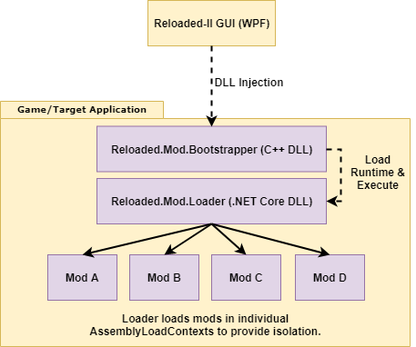
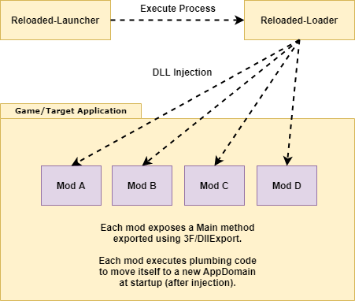

# High Level Architecture

## Reloaded II

In the case of Reloaded II, things change considerably as there is only one standalone application, the WPF Graphical User Interface.

What instead happens is that rather than the Launcher running the Loader as a separate standalone application, the loader instead ships in the form of an injectable DLL. In this case the actual loader itself is injected into the target application, which will in turn initialize and load successive mods using the native .NET APIs.

Once Reloaded is injected, the WPF Graphical User Interface (as well as other programs) can check if Reloaded is present by looking in the modules list of the target. If the Reloaded DLL is there, it can be assumed mods are loaded. 

### Interacting with Reloaded II

Injected Reloaded inside the target process hosts a local UDP server which can easily be interacted with by connecting. As opposed to having a one server and then a client for every single loaded mod, there is only one server (and one client if the Launcher is connected).

Having to create only one host significantly reduces startup time.

### Reloaded II vs Reloaded I 

Below is a summarized list of advantages and disadvantages of the Reloaded II approach over the Reloaded I approach. Given that many advantages and disadvantages are already listed above, this list will focus on the aspects not mentioned prior.

#### Advantages

- **Tagging.** It is very easy to determine whether Reloaded is active/has performed operations on an application. Simply check if the Reloaded DLL is loaded inside the target process.
  - This also makes it possible (and much easier) for other programs to interact with Reloaded. No need to e.g. store the server port in an external file in the case of needing to re-connect.
- **Loader as a Service.** The mod loader can now natively send events to the subscribing mods. (With a tiny bit extra effort). The mods can also send events to the mod loader.
  - This requires a bit of extra effort as the events would need to cross AppDomain boundaries but as no complications are introduced for programmers/mod developers this is ok.
  - This is also of course possible with Reloaded I but requires sending messages using networking. This may not seem like a huge issue until you notice everything has to be serializable and e.g. subscribing multiple methods is extra painful.
- **Faster.** There is very likely to be some kind of overlap in the libraries used by the Reloaded Loader DLL and the mods. Provided that loading mods without re-JIT'ing code proves possible with the use of `AppDomain`'s `LoaderOptimization ` options. 
  - In the very worst case, *Reflection* is faster than *Dll Injection + Reflection*, with additional time also saved not connecting and starting a local server.
- See *Reloaded I - Disadvantages* 

#### Disadvantages

- See *Reloaded I - Advantages*.

## Reloaded I

The original Reloaded Mod Loader works by splitting the launcher application and loader application. Doing so separates the concerns of managing the mods and actually getting them running inside the target application.

When the user selects `Launch` in the application, the Launcher would merely launch the Loader with a specific set of commandline parameters. On startup, the Loader application would read a config at the given path (from commandline parameters), do some setup and inject the relevant mod DLLs.

The Loader application would then also act as a local server that can be used for printing debug messages.

### Advantages

- This is *more lightweight* in terms of RAM usage as the actual mod loader is not injected inside of the target process and can be closed down after DLL injection occurs, although the benefits are minimal.

- *Reloaded Mod DLLs supported by other mod loaders.*
  - Because of AppDomain plumbing code (see below) and use of DLL Exports.
  - On the flipside developer must either export make their own C++ bootstrapper and export `DllMain`  or mod loader must know to run the exported `Main` method.
  - Reloaded-II can also be bootstrapped via the "DLL Loader" method to be executed by other loaders itself, nullifying this point entirely.
- *Support of DLLs programmed in arbitrary Native/Managed programming languages* (provided DLL exports are supported).
  - In theory there is no reason that Reloaded II's architecture couldn't support native DLLs. Only catch is that it will have to distinguish them from .NET ones so a bit more code.

### Disadvantages

- **Does not support "Any CPU" assemblies.** The X86 and X64 versions of the assemblies have to be manually identified by the mod loader or specified by the user. 
- **Slower.** Each DLL Injection requires at the very least the creation of a new thread inside the remote process `CreateRemoteThread`. 
- *Debugging print-outs are delayed due to networking* (even on the same machine). An application can print something and then immediately crash. The print will not be delivered as it has not fully sent before the application crashed.
  - In addition, connecting back to the local server adds to the startup time of the program. In theory ~50-100ms may not be much but it stacks once multiple mods with code are loaded.
- *Each mod requires to have its own copy of the plumbing code* to transfer its execution to another AppDomain.
  - This is bad if changes are required to the plumbing code. Now suddenly every mod needs updated. The plumbing code can be in another assembly and that assembly would load the actual mod DLL. (Work on Reloaded Refactor/Reloaded II began by the point of realization)
  - This is necessary because otherwise, if two mods will have different versions of the same library/assembly e.g. Mod A has JSON.NET 10, Mod B has JSON.NET 11, one mod will crash, killing the whole application.
    - If Mod A (JSON.NET 10) gets loaded first, Mod B will report `System.IO.FileNotFoundException.` on trying to load JSON.NET 11.
    - If Mod B (JSON.NET 11) gets loaded last, Mod A will likely report `MissingMethodException` or `TypeLoadException`.